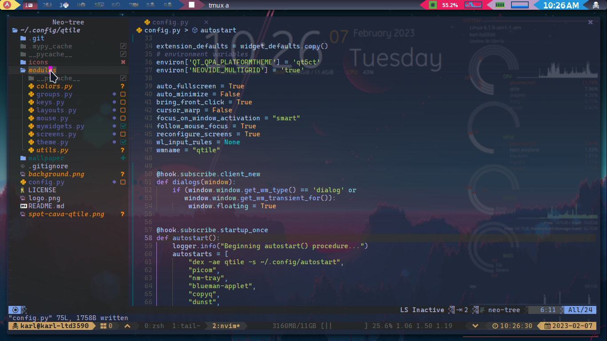
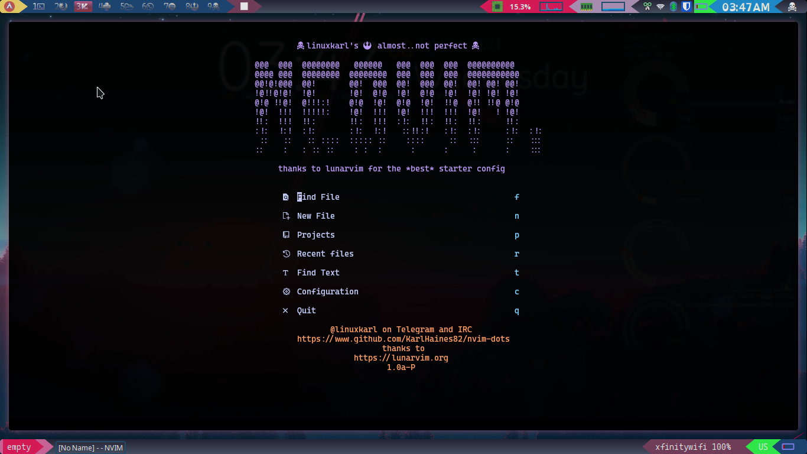
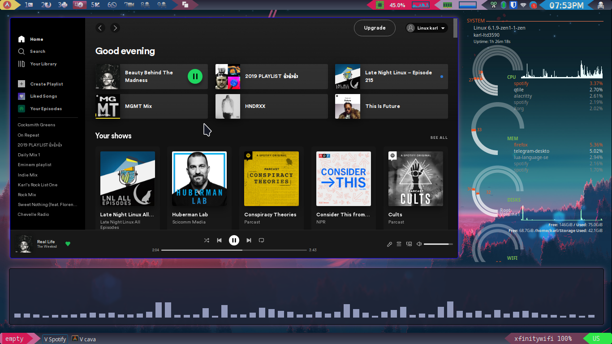
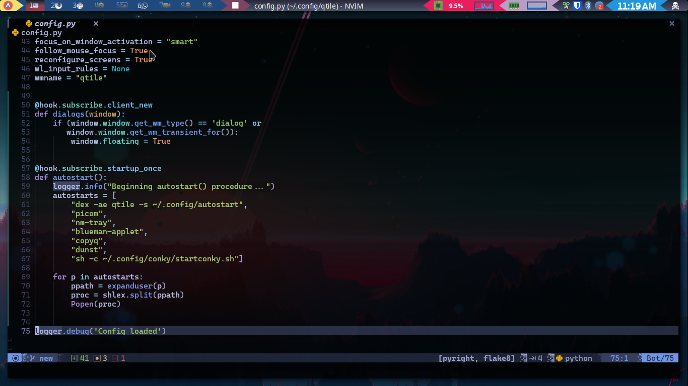
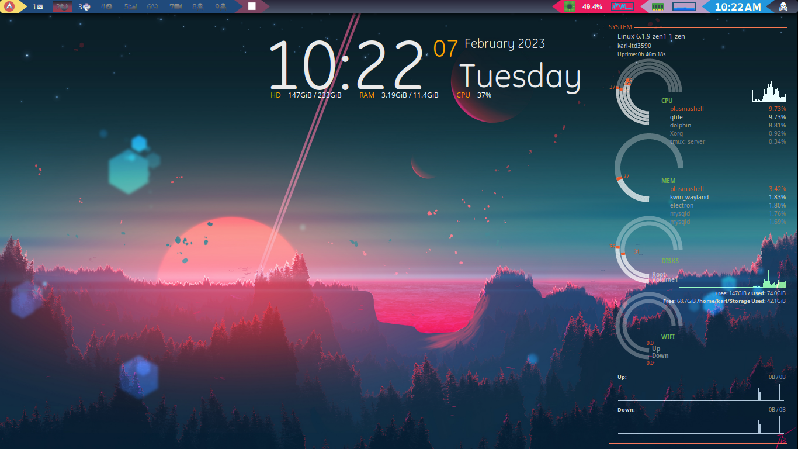

# linuxkarl qtile-dots
## qtile config
A config-junkie's qtile configs. I've spents literally thousands of hours
babying these files into their teenage years. I listented while they filled
my logfiles with teenage crap. I RAISED THEM TO PERFECT. ALMOST. BUT NOT REALLY.
If you like them, you're welcome! And mostly thank you for your interest!
If you have questions, complaints, or comments and would like to contact me,
you can find me on Telegram, @linuxkarl, or on IRC in the #qtile chatroom, also
as linuxkarl.

Thanks again.

### my new neovim setup

### my neovim

### spotify

### screenshot

### conky, etc

### Thanks for visiting!
Feel free to contact me on telegram @linuxkarl615 if you have any questions!

